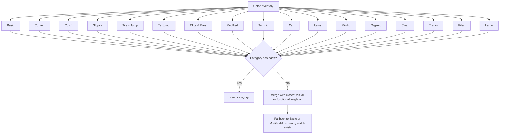

# LEGO Organization Architecture

## Purpose

This document describes a draft system for organizing LEGO parts by color and part type for use in a sorting and inventory app. It covers:

- a category taxonomy for organizing parts
- rules for collapsing empty or low-value categories
- a sample storage layout that connects the taxonomy to real bins or UI groupings

## Category taxonomy

### By color

Within each color, parts can be grouped into the following categories.

| Category | Description |
| --- | --- |
| Basic | Standard bricks and plates |
| Curved | Arcs, circles, and other rounded elements |
| Cutoff | Wedges and angular cut pieces |
| Slopes | Inclined bricks, including studless variants |
| Tile + Jump | Flat tiles and jumper plates |
| Textured | Bricks with surface texture or holes |
| Clips & Bars | Hinges, clips, rods, and bars |
| Modified | Unique or altered shapes that do not fit other groups |
| Technic | Gears, axles, pins, and chain-compatible parts |
| Car | Wheels, fenders, and chassis components |
| Items | Accessories, tools, and miscellaneous objects |
| Minifig | Figures, dolls, and related gear |
| Organic | Plants, horns, rocks, and other natural shapes |
| Clear | Transparent or translucent parts |
| Tracks | Train tracks and rail-compatible pieces |
| Pillar | Structural supports and columns |
| Large | Oversized bricks, baseplates, and specialty elements |

### By part type

For some high-volume element types, it is more useful to organize by part type first and then by color.

| Category | Description |
| --- | --- |
| Dots | 1x1 round tiles |
| Dot accessories | Dot-shaped decorative elements |
| Studs | 1x1 round plates |
| 1x1 plates | 1x1 square plates |
| 1x1 tiles | 1x1 flat tiles |
| 1x1 slopes | Small angled bricks |
| 1x2 slopes | 1x2 slopes, including smooth or studless variants |
| SNOT | Studs Not On Top bricks and side-stud parts |

## Category collapse logic

When a color has no parts in a category, or when the split adds clutter without adding value, adjacent categories should be collapsed.

Example: if the dark tan inventory has no slope pieces, merge `Slopes` into `Cutoff`. Only fall back to `Basic` if `Cutoff` is also too sparse to justify a separate group.

## Sample storage layout

The following table shows one possible mapping from colors to the categories that remain after collapsing.

| Color | Example active categories |
| --- | --- |
| Black | Basic, Slopes, Clips & Bars, Technic |
| White | Basic, Slopes, Modified, Minifig |
| Red | Basic, Curved, Car, Organic |
| Green | Basic, Organic, Tracks, Large |
| Blue | Basic, Car, Technic, Minifig |
| Clear | Basic, Tile + Jump, Modified, Items |

This layout can support:

- a grid-based UI organized by color
- physical drawer or bin labeling
- a database schema that stores both color and category

## Implementation notes

- Generate categories dynamically for each color instead of assuming every color uses the full taxonomy.
- Allow manual overrides when the default merge is not practical for a specific collection.
- Support multiple tags on a single part when a part naturally fits more than one grouping.
- Keep the data model flexible enough to connect physical storage, search filters, and future auto-sorting features.
